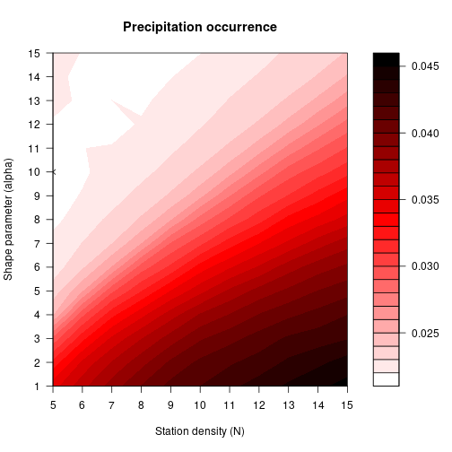
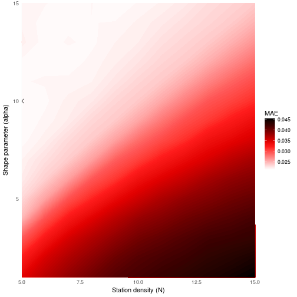
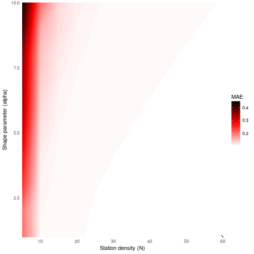
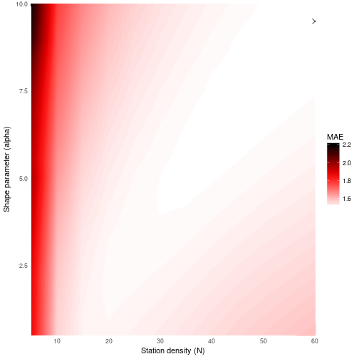
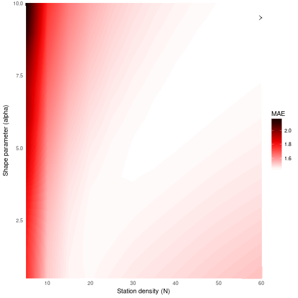
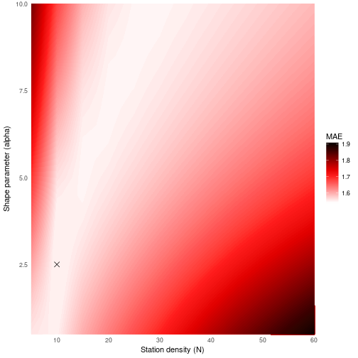

Using `meteoland` package is easy, but some ideas and concepts must be addresed
to make the experience easy for new users. This vignette is intended as a
working example to explain all the steps needed to get comfortable with
`meteoland` workflow.

## Installing and loading the package

First of all, before starting to work with the package, we must install and load
the library. `meteoland` stable version can be found at CRAN
(https://cran.r-project.org/web/packages/meteoland/index.html), and it can be
installed and loaded as any other R package:


```r
install.packages("meteoland")
library(meteoland)
```

## Getting the data in shape

## Calibration and Validation

### Stations data coverage

Once we already have the meteorlogical stations data in shape, we can start
calibrating the model in order to obtain the optimal parameters for the
meteorological variables we want to interpolate.  
Before that, it can be useful to summarise the temporal and spatial coverage
of our data:


```r
spatial_coverage <- interpolation.coverage(interpolator, type = 'spatial')
head(spatial_coverage)
```

```
## class       : SpatialPointsDataFrame 
## features    : 6 
## extent      : 280476, 433925, 4510945, 4667040  (xmin, xmax, ymin, ymax)
## coord. ref. : +proj=utm +zone=31 +ellps=WGS84 +datum=WGS84 +units=m +towgs84=0,0,0 
## variables   : 7
## names       : MinTemperature, MaxTemperature, Precipitation, RelativeHumidity, Radiation, WindSpeed, WindDirection 
## min values  :            352,            352,           352,              306,       330,       260,             0 
## max values  :            365,            364,           365,              358,       364,       365,             0
```


```r
temporal_coverage <- interpolation.coverage(interpolator, type = 'temporal')
head(temporal_coverage)
```

```
##            MinTemperature MaxTemperature Precipitation RelativeHumidity
## 2001-01-01            332            330           475              150
## 2001-01-02            334            334           474              149
## 2001-01-03            337            335           473              150
## 2001-01-04            337            336           476              150
## 2001-01-05            338            335           476              150
## 2001-01-06            334            332           476              147
##            Radiation WindSpeed WindDirection
## 2001-01-01       123        65             0
## 2001-01-02       123        66             0
## 2001-01-03       123        66             0
## 2001-01-04       123        67             0
## 2001-01-05       123        67             0
## 2001-01-06       119        65             0
```

As you can see, `interpolation.coverage` function is used to summarise the
coverage of our data. Specifing `type = 'spatial'` returns an
`SpatialPointsDataFrame` class object with the number of dates with data per
station and metereological variable, whereas `type = 'temporal'` returns a data
frame with the number of stations with data per day (rows) and meterological
variable (columns).  

It seems like the data is ok, so we can go further to the next step.

### Calibration

Calibration must be done for each desired variable, being the process the same
for each variable. Here we will describe how to do it for precipitation
occurrence. We will use `interpolation.calibration` function, which need to be
supplied with the stations data (a `MetereologyInterpolationData` class object),
the variable name as a string and finally, $N$ and $\alpha$ values to be tested:


```r
precev_cal <- interpolation.calibration(interpolator, variable = "PrecEvent",
                                        N_seq = seq(5, 15, by = 1),
                                        alpha_seq = seq(1.0, 15.0, by = 1.0),
                                        verbose = TRUE)
```

This function returns an `interpolation.calibration` class object which contains
several items:

 + Numeric matrix with the mean absolute error (MAE) values for each
 combination of parameters $N$ and $\alpha$.
 + Miminum value found for MAE.
 + Value for the $N$ parameter corresponding to the minumun MAE.
 + Value for the $\alpha$ parameter corresponding to the minimum MAE.
 + Matrix with the observed values.
 + Matrix with the predicted values for the optimum parameter combination.

We can see the MAE and parameter values found in the calibration:


```r
precev_cal$minMAE
## [1] 0.02172621
precev_cal$N
## [1] 5
precev_cal$alpha
## [1] 10
```

We can also see the results visually, with `lattice`


```r
z = precev_cal$MAE
x = as.numeric(rownames(precev_cal$MAE))
y = as.numeric(colnames(precev_cal$MAE))
filled.contour(x,y,z, main = "Precipitation occurrence",
               plot.axes = {points(precev_cal$N,precev_cal$alpha, cex=1, pch=4)
                 axis(1, 1:15)
                 axis(2, 1:15)},
               xlab = "Station density (N)",
               ylab = "Shape parameter (alpha)",
               color.palette = colorRampPalette(c("white","red","black")))
```



or `ggplot2`


```r
library(ggplot2)

contour_ggplot <- function(calibration) {
  ######## function for contour, modified from here
  ## https://stackoverflow.com/questions/28469829/how-to-fill-in-the-contour-fully-using-stat-contour
  # adapt the data
  data <- expand.grid(N = as.numeric(rownames(calibration$MAE)),
                      alpha = as.numeric(colnames(calibration$MAE)))
  data$MAE <- as.numeric(calibration$MAE)
  # column names for axes
  column_names <- names(data)
  # fixed new column names for easy call inside the function
  names(data) <- c('x', 'y', 'z')
  # range and dimensions of the variables, needed for get arbitrary value to expand the grid
  vars_range <- as.data.frame(sapply(data, range))
  vars_dims <- as.data.frame(t(sapply(data, function(x) length(unique(x)))))
  # arbitrary z value to expand the grid (we need to expand the grid a little to be able to close the
  # polygons in geom_contour, if not, bad things happen, like artifacts)
  z_arbitrary <- vars_range$z[1] - diff(vars_range$z)/100
  # now we create the new data frame to plot
  plot_data <- rbind(
    data,
    # expand x, y, z grid in all directions
    expand.grid(x = c(vars_range$x[1] - diff(vars_range$x)/100,
                      vars_range$x[2] + diff(vars_range$x)/100),
                y = seq(vars_range$y[1], vars_range$y[2], length = vars_dims$y),
                z = z_arbitrary),
    expand.grid(x = seq(vars_range$x[1], vars_range$x[2], length = vars_dims$x),
                y = c(vars_range$y[1] - diff(vars_range$y)/100,
                      vars_range$y[2] + diff(vars_range$y)/100),
                z = z_arbitrary)
  )
  # we also need the N and alpha min values to plot the point
  min_parameters <- data.frame(
    N = calibration$N,
    alpha = calibration$alpha
  )
  # and now the plot
  contour_plot <- ggplot(plot_data, aes(x = x, y = y)) +
    stat_contour(geom = 'polygon', mapping = aes(z = z, fill = ..level..),
                 binwidth = diff(vars_range$z)/100) +
    coord_cartesian(xlim = vars_range$x, ylim = vars_range$y, expand = FALSE) +
    geom_point(data = min_parameters, mapping = aes(x = N, y = alpha),
               shape = 4, size = 3) +
    theme_minimal() +
    labs(x = paste0('Station density (', column_names[1],')'),
         y = paste0('Shape parameter (', column_names[2], ')'),
         fill = column_names[3]) +
    scale_fill_gradientn(colours = colorRampPalette(c("white","red","black"))(10))

  return(contour_plot)
}

contour_ggplot(precev_cal)
```



Lets do also the calibration for the other variables:


```r
precam_cal <- interpolation.calibration(interpolator, variable = "PrecAmount",
                                        N_seq = seq(5, 60, by = 5),
                                        alpha_seq = seq(1, 10, by = 1))

tmin_cal <- interpolation.calibration(interpolator, variable = "Tmin",
                                      N_seq = seq(5, 60, by = 5),
                                      alpha_seq = seq(0.5, 10, by = 0.5))

tmax_cal <- interpolation.calibration(interpolator, variable = "Tmax",
                                      N_seq = seq(5, 60, by=5),
                                      alpha_seq = seq(0.5, 10, by = 0.5))

tdew_cal <- interpolation.calibration(interpolator, variable = "Tdew",
                                      N_seq = seq(5, 60, by=5),
                                      alpha_seq = seq(0.5, 10, by = 0.5))
```

And again, we can visually represent the results:


```r
contour_ggplot(precam_cal)
```



```r
contour_ggplot(tmin_cal)
```



```r
contour_ggplot(tmax_cal)
```



```r
contour_ggplot(tdew_cal)
```



Finally, we need to store the parameter values for each variable in the
interpolator data:


```r
interpolator@params = defaultInterpolationParams()
interpolator@params$N_MinTemperature = tmin_cal$N
interpolator@params$alpha_MinTemperature = tmin_cal$alpha
interpolator@params$N_MaxTemperature = tmax_cal$N
interpolator@params$alpha_MaxTemperature = tmax_cal$alpha
interpolator@params$N_DewTemperature = tdew_cal$N
interpolator@params$alpha_DewTemperature = tdew_cal$alpha
interpolator@params$N_PrecipitationEvent = precev_cal$N
interpolator@params$alpha_PrecipitationEvent = precev_cal$alpha
interpolator@params$N_PrecipitationAmount = precam_cal$N
interpolator@params$alpha_PrecipitationAmount = precam_cal$alpha
interpolator@params$St_Precipitation=5
interpolator@params$pop_crit = 0.50
interpolator@params$f_max = 0.95
```

### Cross validation

In order to perfom the interpolation validation we will use the `interpolation.cv`
function:


```r
cv <- interpolation.cv(interpolator)
```

And now we can inspect the results obtained:


